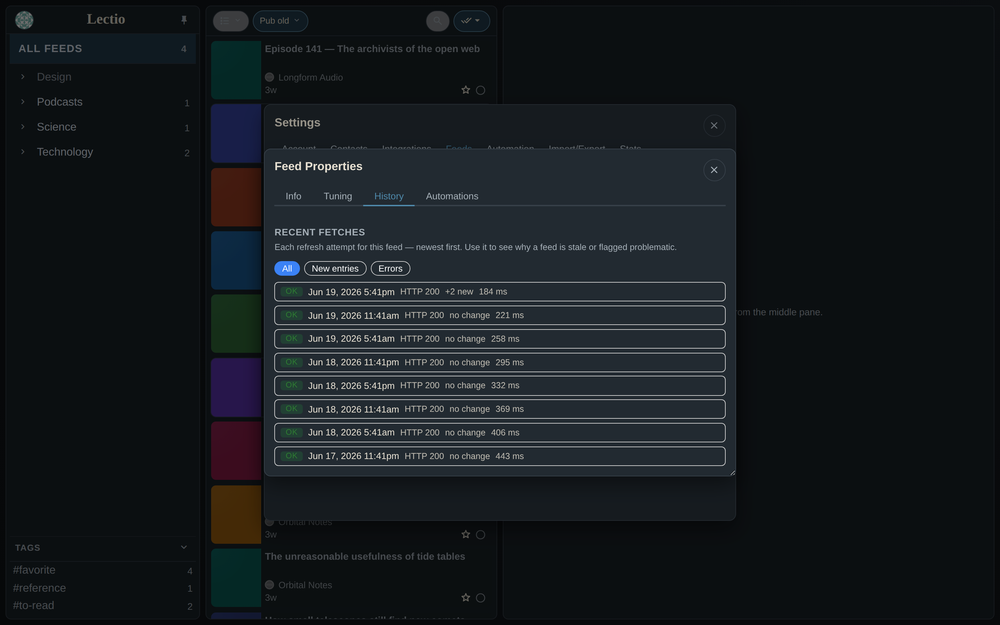
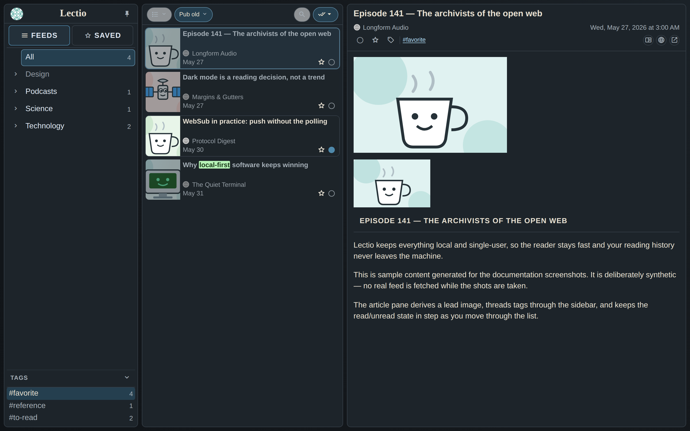
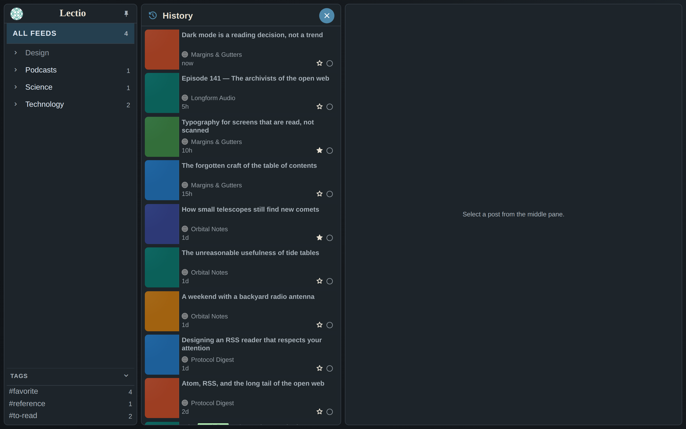
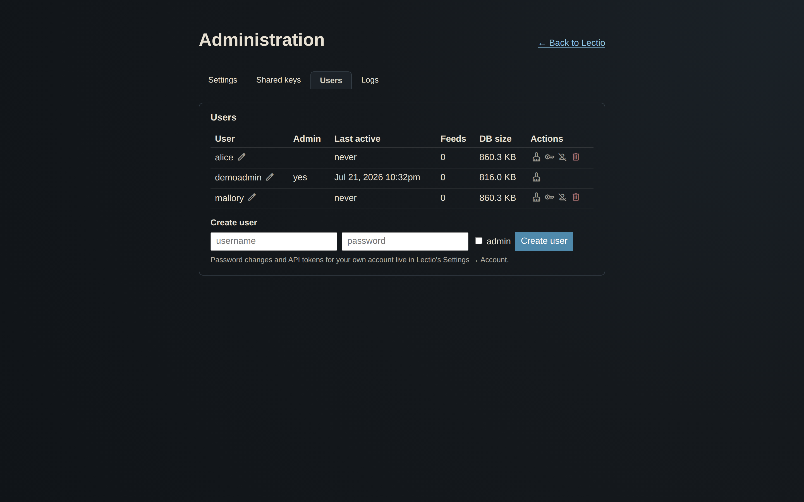

# Lectio

> **Work in progress.** This README covers features and design intent. Setup documentation is forthcoming.

Lectio is a self-hosted, local-first RSS reader with a focus on fast reading triage. It runs as a single-user server behind a TLS proxy and is designed to be deployed on a personal VPS.

---

## What it is

A three-pane desktop RSS reader (folder tree → post list → article pane). Built on Python + FastAPI + the [`reader`](https://github.com/lemon24/reader) library, with a plain-HTML/JS frontend — no build step, no bundler, no framework.

The design priority is **speed of triage**: quickly marking things read, surfacing what matters, and staying out of the way.

---

## Screenshots

| Dark mode | Light mode |
|---|---|
|  |  |

More screenshots

Screenshots are regenerated from synthetic demo data (no real feeds) with
`make screenshots` — see [scripts/refresh_screenshots.py](scripts/refresh_screenshots.py).

---

## Feature highlights

### Reading experience
- Folder tree with recursive post list; read/unread, saved/starred, tags, sort, and filter
- Keyboard navigation throughout
- **Context menus** — right-click (or long-press) a feed, folder, or entry for contextual actions (mark feed/folder as read, etc.) without leaving the current view
- **Manual tags** — tag any article from the article pane (the **Add tags** button); tags appear in the left-pane Tags list. Clicking a tag (sidebar list or article chip) shows **all** articles with that tag (read included); picking a folder/feed afterward restores the read filter you had before (e.g. Unread), the same way Starred/History do. Remove a single tag from a post with the `×` on its chip, or right-click any tag → **Delete tag everywhere** to strip it from every post (the tag drops out of the sidebar once nothing references it)
- **Bulk mark-as-read** — toolbar dropdown or context menu; updates the visible list in-place with no page reload
- **Read History** — reverse-chronological list of individually-opened articles, capped at 2,000 entries (main menu or folder-pane footer)
- **Readability view** — extracts clean article text from the source page
- **Web view proxy** — fetches source pages server-side when sites block embedding; detects Cloudflare/paywall pages
- **Search** within the current scope
- **YouTube duration prefix** — `[H:MM:SS]` shown in post list and title for YouTube feeds
- **Inline podcast player** — entries with a podcast audio enclosure get a native `<audio>` player (plus a download link) at the top of the article. Audio is detected by MIME type or by the file extension on the URL path, so query-string/auth-tokened URLs and untyped enclosures still match; if a feed has no enclosure but its entry link points straight at an audio file, that's used instead
- **Inline rendering fixups** — emoji glyphs embedded as images (WordPress wp-smiley, IP.Board/twemoji) are sized to match the surrounding text instead of rendering as full-size images; body images load with `referrerpolicy="no-referrer"` so hotlink-protected hosts (which swap a placeholder image when the referer is foreign) serve the real image, and known hotlink hosts are routed through the built-in image proxy so even a previously cached placeholder is bypassed. The proxy keeps a server-side cache of fetched images (`LECTIO_IMG_CACHE_DAYS` last-accessed retention, `0` = keep forever; downscaled to `LECTIO_IMG_CACHE_MAX_DIM` px on the longest side — both adjustable in the Administration page), so images load faster on revisits and survive short-lived signed CDN URLs (e.g. DeviantArt/wixmp) even after their tokens expire
- **Bare-text feed rendering** — feeds that ship a plain-text summary instead of HTML (bare `https://` URLs, line breaks as literal or double-escaped ` `) get those URLs linkified and breaks rendered, rather than shown as unstyled literal text; bare image URLs render as inline images, and inconsistently double-escaped ampersands in links (e.g. `&amp;amp;`) are normalized so the links actually work; genuinely plain prose is left in a whitespace-preserving block
- **Rachel by the Bay** support.

### Lead images
- Per-feed **image extraction strategy**: Auto-detect, Webcomic (source-page scrape), Artwork (for art-portfolio feeds like ArtStation), Feed content only, Source scraping, Media RSS, or None
- **Strategy comparison** in Feed Properties — runs all strategies against the current article, shows results side-by-side with actual image dimensions
- Pin any strategy result as the post thumbnail; set a custom URL or feed favicon as a fixed thumbnail (saving a custom URL re-enables thumbnails if they were disabled); choose thumbnail fit mode (Fill / Fit / Smart) and anchor position via a 3×3 grid
- **Smart crop sensitivity** — per-feed in Feed Properties (shown when fit mode is Smart): minimum fraction of the image the content-aware crop must keep (0.5–1.0, default 0.9); lower values crop more aggressively
- **Fill zoom** — per-feed in Feed Properties (shown when fit mode is Fill/cover): zoom multiplier (0.5–2.0, default 1.0); values below 1.0 show more of the image with black letterbox bars, above 1.0 crop more tightly than the default tight fill
- **Caption source** — Alt / Title checkboxes select which HTML attribute to show as the image caption; **↺ Auto** applies title-preferred logic with junk suppression; text is pre-loaded at refresh (no pop-in). For **Webcomic** feeds where the comic image carries no alt/title, the hover/secret text is pulled from the WordPress Webcomic plugin's alt-text balloon (falling back to `og:description`)
- Art-portfolio feeds (ArtStation) auto-assigned **Artwork** strategy; feeds in "comic"-named folders auto-assigned **Webcomic**
- GitHub release feeds (`github.com/*/releases.atom`) auto-assigned **og_scrape** strategy (GitHub generates a unique social-preview card per release) with list thumbnails suppressed
- ArtStation feed URLs normalized to `www.artstation.com/username.rss` at add time (avoids TLS hostname issues with underscore usernames)
- **Thumbnail fallbacks** — when source-page scraping finds no image (e.g. a JS-only portfolio page), the entry's own inline feed image is used instead of a blank; a feed pinned to Media RSS / Feed-content that extracts nothing falls back to the cached lead image; and "related posts" widgets are stripped before scraping so a post with no image of its own never borrows a sibling post's thumbnail
- **Junk-image rejection** — social share-button sprites (AddToAny/AddThis "Share"), analytics tracking pixels (statcounter "Web Analytics"), and inline emoji glyphs (WordPress wp-smiley, twemoji) are never chosen as a post's lead image, so image-less posts don't show a stray button/grey-pixel thumbnail with a bogus "Share" / "Web Analytics" caption
- **Inline SVG lead images** — when a post has no raster image but its content carries a raw inline `<svg>` (e.g. analogue.co firmware notes), that SVG is used as the list thumbnail and article lead image. It's sanitized (scripts, event handlers, and external/`href` references stripped — only drawing primitives kept) and served as a `data:` URI, so it stays vector and needs no outbound fetch. A `currentColor`-driven monochrome icon gets a neutral fallback color so it stays visible as a standalone image

### Automation
- **Highlight** — keyword/regex rules color-highlight matching titles and article body text
- **Mark as Read** — auto-marks matching entries at fetch time; scoped per feed, folder, or globally
- **Deduplicate** — marks newer duplicates read across feeds; URL slug, title, slug+title, fuzzy, or safe match modes; results logged with per-article detail
- **Email Article rules** — server-side rules that send matching articles via email (Resend); immediate or daily digest mode with Cc option
- **Email Article dialog** — a "choose a saved contact" dropdown (your default address plus Settings → Contacts) fills the "To" field, which still accepts any address you type; a "Cc me" checkbox copies you on the message and sets Reply-To to your address, so a recipient's reply reaches you (rather than bouncing off the no-reply sender domain)
- All rules fire automatically at refresh time; manual "Run Now" available
- **Quick rule from a post** — right-click a post title (in the list or the entry header) → Automation to open the rule editor with that feed pre-selected and the title pre-filled in the match field; right-click a feed name → Automation pre-selects that feed

### Feed management
- **OPML import/export**
- **RSS/Atom auto-discovery** — paste a website URL; probes for `<link rel="alternate">` and common feed path suffixes; RSS is preferred over Atom when both are advertised (RSS `<enclosure>` tags improve thumbnail availability)
- **Page Feed (FakeFeedz)** — subscribe to any webpage as a feed: new links mode or content-change mode, with optional CSS selector
- **YouTube folder sync** — sync a folder to a YouTube channel's video feed via YouTube Data API
- **DeviantArt** — DeviantArt's legacy RSS endpoint is WAF-blocked, so Lectio uses the DeviantArt API. Register a **Confidential** app at [deviantart.com/studio/apps](https://www.deviantart.com/studio/apps), put the Client ID + Secret in Settings → Integrations (per-user), whitelist the `…/deviantart/callback` redirect URI, and **Connect** your account (OAuth2 + PKCE).
  - **Watch feed** — one combined feed of new posts from everyone you Watch (via `/browse/deviantsyouwatch`), like a subscriptions timeline. A single feed refreshed with a few API calls — far friendlier to DeviantArt's per-user rate limit than one feed per artist.
  - **Add = Watch** — while connected, adding a `deviantart.com/<user>` URL Watches that artist on DeviantArt (so they show up in the Watch feed) rather than creating a separate feed. (Not connected → falls back to a standalone gallery feed.)
  - **Watch-list sync** — adds a gallery feed for everyone you Watch on DeviantArt (add-only). Runs automatically in nightly maintenance for connected users, and on demand from the Settings button.
- **Hide Shorts** — per-feed toggle (YouTube feeds only) to automatically mark YouTube Shorts as read at fetch time
- **Per-folder refresh cadence** — set a custom polling interval (1 min to once a day) that overrides the global interval for feeds in that folder; change it inline from the refresh dropdown on each row in Settings → Feeds → Folders, or by right-clicking a folder → Properties
- **Folders tree in Settings → Feeds** — expand any folder to list its feeds inline; folder rows have glyphs for Properties and Automation, and each feed row opens its Properties by clicking the feed name, with glyphs for Automation and disable/enable. Disabled feeds stay listed (greyed, sorted to the bottom) so they're easy to re-enable; a search box at the top filters the feeds live as you type
- **Compare subscribed feeds** — tick the checkbox on 2–6 feed rows in Settings → Feeds → Folders and click "Compare selected" to see a head-to-head breakdown of format, full-text vs summaries, image presence, date fields, and GUID type — the same chips used in the Add Feed picker
- **Feed Properties** — health status, post counts, backoff state, per-feed image and thumbnail tuning
  - **History tab** — a per-refresh log of recent fetch attempts (timestamp, OK/error, HTTP status, new-entry count, duration) with All / New entries / Errors filters, so you can see why a feed is stale or flagged problematic. Retention is bounded (newest `LECTIO_FETCH_HISTORY_KEEP` per feed, dropped after `LECTIO_FETCH_HISTORY_MAX_AGE_DAYS`)
  - **Pause / Resume updates** — suspend automatic fetching for a feed without unsubscribing
  - **Change URL** — update a feed's URL in-place; history, images, rules, and display prefs migrate automatically
  - **Automations tab** — shows which rules act on this feed (because they're scoped to it, its folder, or all feeds) and the recent automation runs that touched its entries, so you can see what Lectio is doing to a feed without reading the rules list
- **Duplicate feed scan** (Manage Feeds → Duplicates) — detects feeds subscribed more than once under different URL variants: trailing-slash differences, format-selector params (`?alt=rss`), and known equivalent/renamed domains (e.g. `old.reddit.com` ↔ `www.reddit.com`, and `tapastic.com` → `tapas.io`). Renamed domains are rewritten automatically when adding or importing feeds. Same-folder duplicates are auto-removed; cross-folder duplicates let you choose which folder to keep. Optional **Rescue unread posts** (default on) marks entries in the surviving feed as unread if the removed feed had them unread, preventing posts silently lost to Deduplicate rules from disappearing permanently.

### Icons
- **Feed favicons** — sidebar feed icons are resolved server-side via `/api/favicon`, which tries Google's faviconV2 service first, then falls back to the site's own `/favicon.ico`, and finally serves a neutral SVG globe placeholder. Results are cached in the image-cache DB so repeat lookups skip outbound fetches entirely. This eliminates console 404s for feeds whose domains Google's service can't resolve (private/less-indexed sites).

### Reliability
- Conditional HTTP requests (ETag / If-Modified-Since via `reader` library)
- Exponential backoff per feed and per domain on errors; 410 Gone permanently disables a feed
- HTML-response detection — surfaces "returned an HTML page instead of a feed" as a health error
- **GUID-churn suppression** — entries that reappear with a new GUID but the same URL slug, or the same title + date (within 7 days), are automatically marked read after refresh; a startup cleanup pass also retroactively deduplicates within each feed and across feeds that syndicate the same post
- Feed User-Agent: `Lectio/0.1 (+https://github.com/joshg253/Lectio)`
- WAL-mode SQLite for all databases

### Real-time updates
- **WebSub (PubSubHubbub)** — feeds that advertise a hub receive real-time push updates instead of waiting for the next poll; HMAC-verified, subscriptions renewed automatically. Requires `LECTIO_PUBLIC_URL` in `.env`. Feeds with a confirmed active push subscription show a small ⚡ glyph next to their name in the sidebar and in Settings → Feeds, so you can tell at a glance which feeds deliver instantly. Unsubscribing a feed also sends the hub a proper unsubscription request so the subscription is cleaned up immediately rather than waiting for it to expire.

### API compatibility
- **GReader API** — Google Reader-compatible API at `/greader`; works with Capy, Readrops, Aggregator, Read You, and other Android/desktop clients. Authenticate with your Lectio username and `LECTIO_FEVER_PASSWORD` (single mode) or your per-user API token from `/account` (multi mode).
- **Fever API** — Fever-compatible API at `/fever`; works with Reeder, FeedMe, NetNewsWire, etc. Set `LECTIO_FEVER_PASSWORD` in `.env` to enable (single mode), or use your per-user API token from `/account` (multi mode). Uses a dedicated credential (not your main login) because Fever transmits credentials as MD5.

### Multi-user (optional)
- **Security modes** — `LECTIO_SECURITY_MODE=single` (default) is the classic single-user setup. `multi` enables per-user accounts: each user gets isolated databases under `data/users/<username>/`, while thumbnails and image caches stay shared. Set the bootstrap admin with `LECTIO_ADMIN_USERNAME` / `LECTIO_ADMIN_PASSWORD` (created on first start), and pick a password hashing scheme with `LECTIO_PASSWORD_HASH_SCHEME` (`scrypt` default, `pbkdf2_sha256`, or `argon2` with `argon2-cffi` installed).
- **Account page** — visit `/account` to change your password and view/regenerate your API token; admins can create, disable, rename, and permanently delete users (deletion removes the account and its isolated data directory — feeds, folders, and saved articles — but leaves the shared image/thumbnail caches) and reset passwords. You cannot delete your own account or the last remaining admin. In multi mode each user authenticates to the GReader/Fever APIs with their own username + API token (shown on `/account`).
- **Outbound-fetch hardening** — feed discovery, the source/Readability proxy, and image proxies refuse private/loopback/link-local targets (SSRF); only `http(s)` feed URLs can be subscribed (Add Feed / OPML reject `file://` etc.); proxied page HTML is sanitized against XSS. Set `LECTIO_DEBUG=1` only for local development — it disables the SSRF guard so LAN feeds work.
- **Migrating an existing instance** — converting a single-user install to multi-user is a one-time copy of your data into the per-user layout; see [docs/multiuser-migration.md](docs/multiuser-migration.md) (`scripts/migrate_to_multiuser.py`, dry-run by default).

### Data portability
- **Takeout / Export & Import** — ZIP archive containing feeds (OPML), rules, contacts, tags, starred entries, read history, and settings; imports non-destructively
- **Backup script** — online-safe SQLite `VACUUM INTO` snapshots via `scripts/backup_databases.py`

### Integrations
- **Instapaper** — "Save to Instapaper" button in the entry toolbar
- **Email** — Resend API for Email Article and Email Article rules
- **Settings UI** — all API keys and options configurable in-app (env vars still accepted as fallback)

---

## Technical overview

| Layer | What it does |
|---|---|
| `main.py` | FastAPI routes, Jinja2 templates, all request handling |
| `services/` | Feed refresh, lead images, email, starred archive, YouTube, reader API wrapper |
| `reader` library | Feed fetching, parsing, storage, ETag/conditional requests |
| `lectio.db` | reader's SQLite feed+entry store |
| `lectio_meta.sqlite3` | App state: prefs, automation rules, lead images, read history, failure tracking |
| `lectio_meta.sqlite` | Starred/saved entry archive |

---

## Stack

- **Backend**: Python 3.14, FastAPI, uvicorn
- **Feed library**: [reader](https://github.com/lemon24/reader) (handles HTTP, parsing, ETags, scheduling)
- **Frontend**: Vanilla JS, Jinja2 templates, no build step
- **Database**: SQLite (WAL mode) × 3
- **Deployment**: Docker + docker-compose, Traefik reverse proxy

---

## Development

- **Tests** — pytest suite (unit, services, integration, scripts) under `tests/`. Run with `uv run pytest`.
- **CI** — GitHub Actions runs the suite on Python 3.14 for every pull request and push to `main` ([`.github/workflows/ci.yml`](.github/workflows/ci.yml)). Dependencies install from the locked `uv.lock` (`uv sync --frozen`), and the run treats any `DeprecationWarning` as an error so they surface immediately rather than accumulating.
- **Dependency audit** — `uv audit` (OSV-backed) scans the locked dependencies for known vulnerabilities and deprecated packages. Run it locally with `make audit`; CI runs the same scan. It's a uv preview feature, so it's kept separate from `make test` locally and the CI step is informational (non-blocking) for now.

---

## Status

Active personal use. Not yet documented for general deployment. The codebase moves fast — APIs, DB schema, and config format may change without notice.

Issues and PRs welcome, but this is primarily a personal project.
