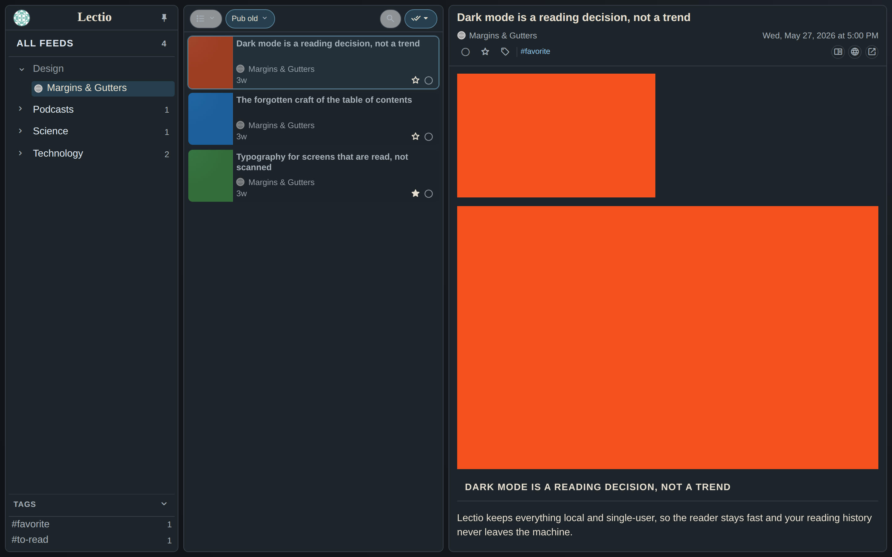
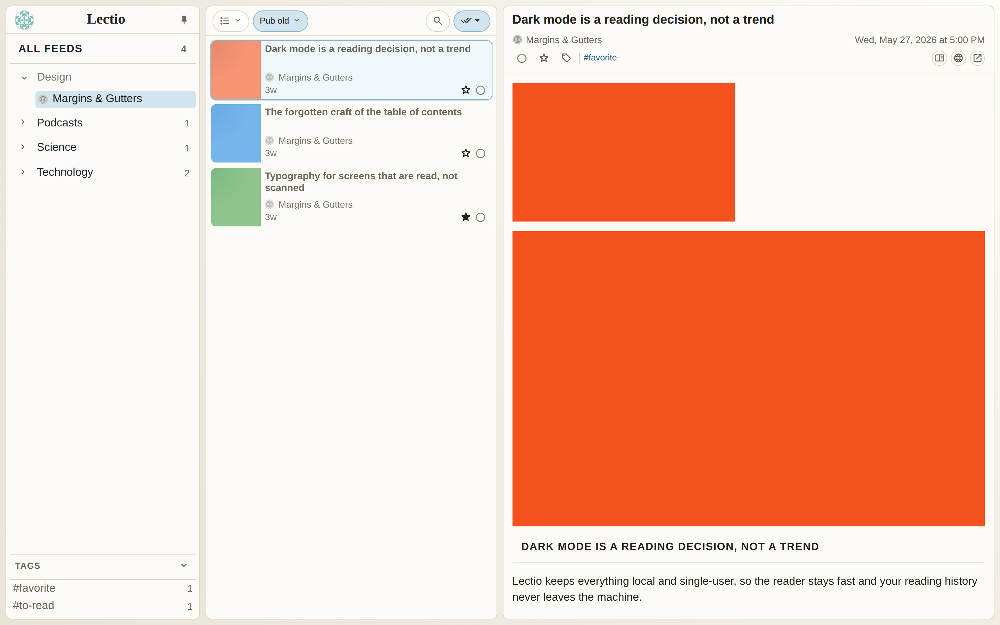
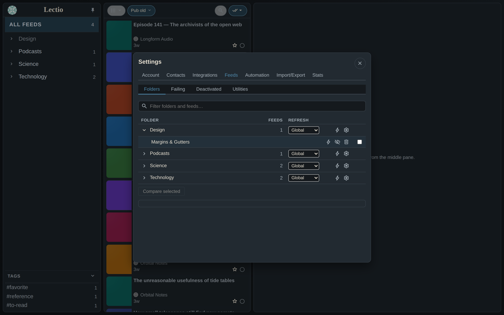
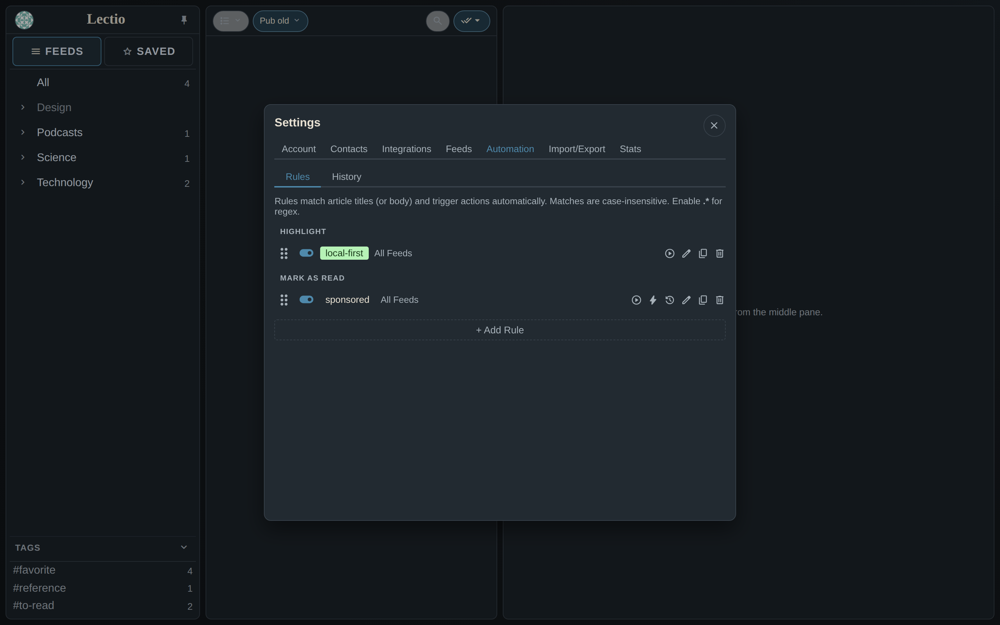
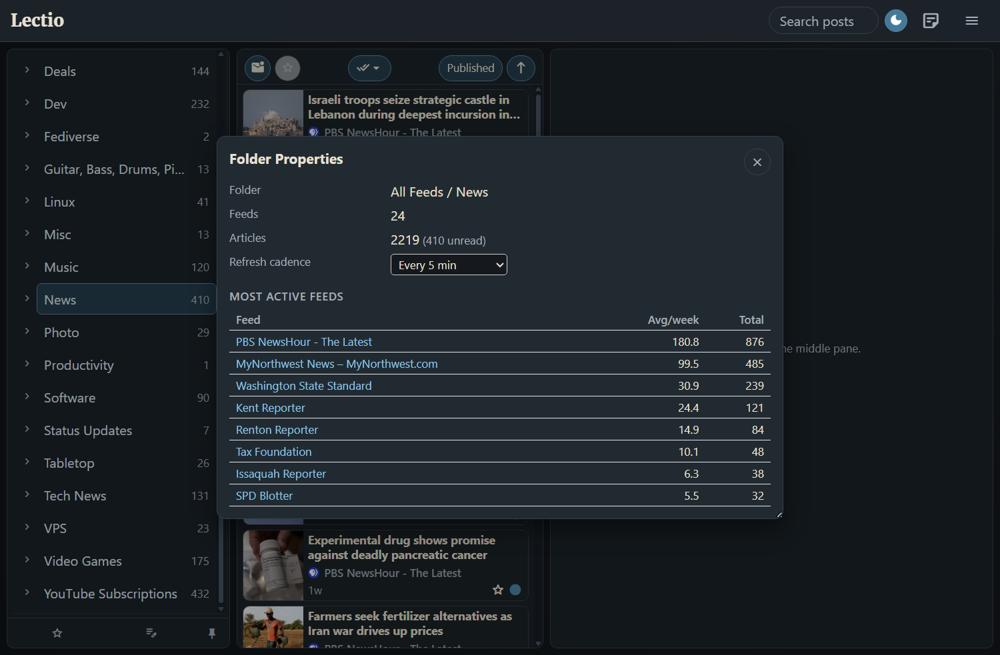
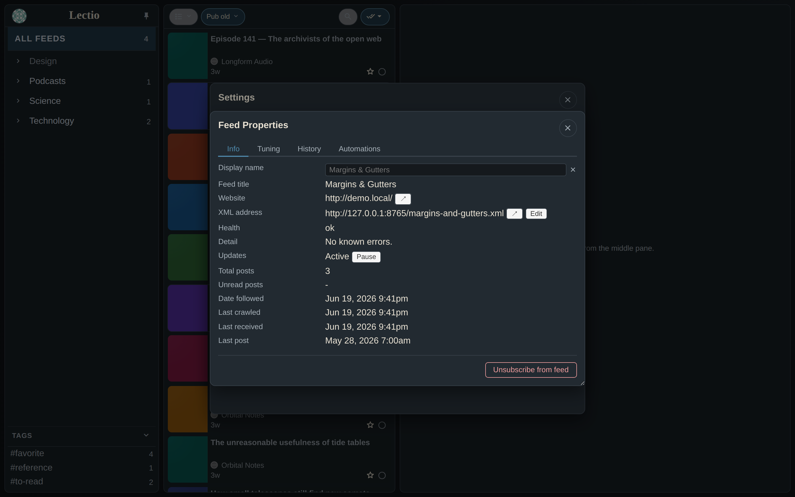
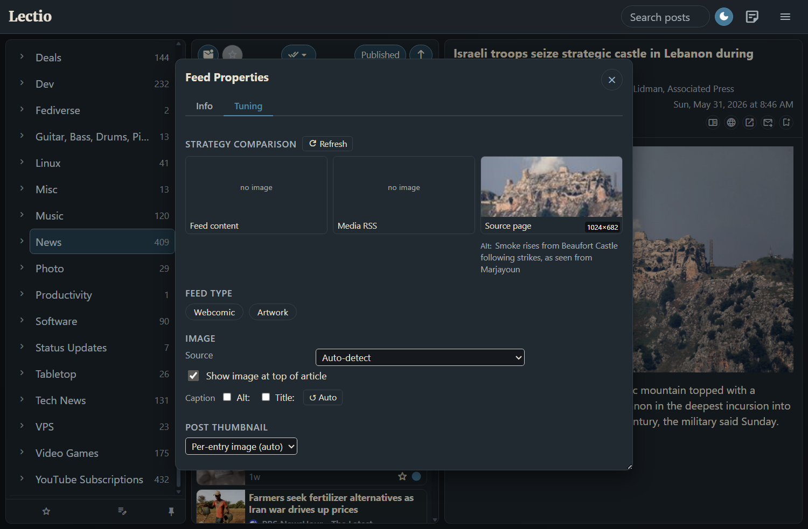

# Lectio

> **Work in progress.** This README covers features and design intent. Setup documentation is forthcoming.

Lectio is a self-hosted, local-first RSS reader with a focus on fast reading triage. It runs as a single-user server behind a TLS proxy and is designed to be deployed on a personal VPS.

---

## What it is

A three-pane desktop RSS reader (folder tree → post list → article pane). Built on Python + FastAPI + the [`reader`](https://github.com/lemon24/reader) library, with a plain-HTML/JS frontend — no build step, no bundler, no framework.

The design priority is **speed of triage**: quickly marking things read, surfacing what matters, and staying out of the way.

---

## Screenshots

| Dark mode | Light mode |
|---|---|
|  |  |

More screenshots

---

## Feature highlights

### Reading experience
- Folder tree with recursive post list; read/unread, saved/starred, tags, sort, and filter
- Keyboard navigation throughout
- **Context menus** — right-click (or long-press) a feed, folder, or entry for contextual actions (mark feed/folder as read, etc.) without leaving the current view
- **Bulk mark-as-read** — toolbar dropdown or context menu; updates the visible list in-place with no page reload
- **Read History** — reverse-chronological list of individually-opened articles, capped at 2,000 entries (main menu or folder-pane footer)
- **Readability view** — extracts clean article text from the source page
- **Web view proxy** — fetches source pages server-side when sites block embedding; detects Cloudflare/paywall pages
- **Search** within the current scope
- **YouTube duration prefix** — `[H:MM:SS]` shown in post list and title for YouTube feeds
- **Rachel by the Bay** support.

### Lead images
- Per-feed **image extraction strategy**: Auto-detect, Webcomic (source-page scrape), Artwork (for art-portfolio feeds like ArtStation), Feed content only, Source scraping, Media RSS, or None
- **Strategy comparison** in Feed Properties — runs all strategies against the current article, shows results side-by-side with actual image dimensions
- Pin any strategy result as the post thumbnail; set a custom URL or feed favicon as a fixed thumbnail (saving a custom URL re-enables thumbnails if they were disabled); choose thumbnail fit mode (Fill / Fit / Smart) and anchor position via a 3×3 grid
- **Smart crop sensitivity** — per-feed in Feed Properties (shown when fit mode is Smart): minimum fraction of the image the content-aware crop must keep (0.5–1.0, default 0.9); lower values crop more aggressively
- **Fill zoom** — per-feed in Feed Properties (shown when fit mode is Fill/cover): zoom multiplier (0.5–2.0, default 1.0); values below 1.0 show more of the image with black letterbox bars, above 1.0 crop more tightly than the default tight fill
- **Caption source** — Alt / Title checkboxes select which HTML attribute to show as the image caption; **↺ Auto** applies title-preferred logic with junk suppression; text is pre-loaded at refresh (no pop-in). For **Webcomic** feeds where the comic image carries no alt/title, the hover/secret text is pulled from the WordPress Webcomic plugin's alt-text balloon (falling back to `og:description`)
- Art-portfolio feeds (ArtStation) auto-assigned **Artwork** strategy; feeds in "comic"-named folders auto-assigned **Webcomic**
- GitHub release feeds (`github.com/*/releases.atom`) auto-assigned **og_scrape** strategy (GitHub generates a unique social-preview card per release) with list thumbnails suppressed
- ArtStation feed URLs normalized to `www.artstation.com/username.rss` at add time (avoids TLS hostname issues with underscore usernames)
- **Thumbnail fallbacks** — when source-page scraping finds no image (e.g. a JS-only portfolio page), the entry's own inline feed image is used instead of a blank; a feed pinned to Media RSS / Feed-content that extracts nothing falls back to the cached lead image; and "related posts" widgets are stripped before scraping so a post with no image of its own never borrows a sibling post's thumbnail

### Automation
- **Highlight** — keyword/regex rules color-highlight matching titles and article body text
- **Mark as Read** — auto-marks matching entries at fetch time; scoped per feed, folder, or globally
- **Deduplicate** — marks newer duplicates read across feeds; URL slug, title, slug+title, fuzzy, or safe match modes; results logged with per-article detail
- **Email Article rules** — server-side rules that send matching articles via email (Resend); immediate or daily digest mode with Cc option
- All rules fire automatically at refresh time; manual "Run Now" available
- **Quick rule from a post** — right-click a post title (in the list or the entry header) → Automation to open the rule editor with that feed pre-selected and the title pre-filled in the match field; right-click a feed name → Automation pre-selects that feed

### Feed management
- **OPML import/export**
- **RSS/Atom auto-discovery** — paste a website URL; probes for `<link rel="alternate">` and common feed path suffixes; RSS is preferred over Atom when both are advertised (RSS `<enclosure>` tags improve thumbnail availability)
- **Page Feed (FakeFeedz)** — subscribe to any webpage as a feed: new links mode or content-change mode, with optional CSS selector
- **YouTube folder sync** — sync a folder to a YouTube channel's video feed via YouTube Data API
- **Hide Shorts** — per-feed toggle (YouTube feeds only) to automatically mark YouTube Shorts as read at fetch time
- **Per-folder refresh cadence** — right-click a folder → Properties to set a custom polling interval (5 min to once a day); overrides the global interval for feeds in that folder
- **Feed Properties** — health status, post counts, backoff state, per-feed image and thumbnail tuning
  - **Pause / Resume updates** — suspend automatic fetching for a feed without unsubscribing
  - **Change URL** — update a feed's URL in-place; history, images, rules, and display prefs migrate automatically
- **Duplicate feed scan** (Manage Feeds → Duplicates) — detects feeds subscribed more than once under different URL variants: trailing-slash differences, format-selector params (`?alt=rss`), and known equivalent domains (e.g. `old.reddit.com` ↔ `www.reddit.com`). Same-folder duplicates are auto-removed; cross-folder duplicates let you choose which folder to keep. Optional **Rescue unread posts** (default on) marks entries in the surviving feed as unread if the removed feed had them unread, preventing posts silently lost to Deduplicate rules from disappearing permanently.

### Reliability
- Conditional HTTP requests (ETag / If-Modified-Since via `reader` library)
- Exponential backoff per feed and per domain on errors; 410 Gone permanently disables a feed
- HTML-response detection — surfaces "returned an HTML page instead of a feed" as a health error
- **GUID-churn suppression** — entries that reappear with a new GUID but the same URL slug, or the same title + date (within 7 days), are automatically marked read after refresh; a startup cleanup pass also retroactively deduplicates within each feed and across feeds that syndicate the same post
- Feed User-Agent: `Lectio/0.1 (+https://github.com/joshg253/Lectio)`
- WAL-mode SQLite for all databases

### Real-time updates
- **WebSub (PubSubHubbub)** — feeds that advertise a hub receive real-time push updates instead of waiting for the next poll; HMAC-verified, subscriptions renewed automatically. Requires `LECTIO_PUBLIC_URL` in `.env`.

### API compatibility
- **GReader API** — Google Reader-compatible API at `/greader`; works with Capy, Readrops, Aggregator, Read You, and other Android/desktop clients. Authenticate with your Lectio username and `LECTIO_FEVER_PASSWORD` (single mode) or your per-user API token from `/account` (multi mode).
- **Fever API** — Fever-compatible API at `/fever`; works with Reeder, FeedMe, NetNewsWire, etc. Set `LECTIO_FEVER_PASSWORD` in `.env` to enable (single mode), or use your per-user API token from `/account` (multi mode). Uses a dedicated credential (not your main login) because Fever transmits credentials as MD5.

### Multi-user (optional)
- **Security modes** — `LECTIO_SECURITY_MODE=single` (default) is the classic single-user setup. `multi` enables per-user accounts: each user gets isolated databases under `data/users/<username>/`, while thumbnails and image caches stay shared. Set the bootstrap admin with `LECTIO_ADMIN_USERNAME` / `LECTIO_ADMIN_PASSWORD` (created on first start), and pick a password hashing scheme with `LECTIO_PASSWORD_HASH_SCHEME` (`scrypt` default, `pbkdf2_sha256`, or `argon2` with `argon2-cffi` installed).
- **Account page** — visit `/account` to change your password and view/regenerate your API token; admins can create/disable users and reset passwords. In multi mode each user authenticates to the GReader/Fever APIs with their own username + API token (shown on `/account`).
- **Outbound-fetch hardening** — feed discovery, the source/Readability proxy, and image proxies refuse private/loopback/link-local targets (SSRF); only `http(s)` feed URLs can be subscribed (Add Feed / OPML reject `file://` etc.); proxied page HTML is sanitized against XSS. Set `LECTIO_DEBUG=1` only for local development — it disables the SSRF guard so LAN feeds work.
- **Migrating an existing instance** — converting a single-user install to multi-user is a one-time copy of your data into the per-user layout; see [docs/multiuser-migration.md](docs/multiuser-migration.md) (`scripts/migrate_to_multiuser.py`, dry-run by default).

### Data portability
- **Takeout / Export & Import** — ZIP archive containing feeds (OPML), rules, contacts, tags, starred entries, read history, and settings; imports non-destructively
- **Backup script** — online-safe SQLite `VACUUM INTO` snapshots via `scripts/backup_databases.py`

### Integrations
- **Instapaper** — "Save to Instapaper" button in the entry toolbar
- **Email** — Resend API for Email Article and Email Article rules
- **Settings UI** — all API keys and options configurable in-app (env vars still accepted as fallback)

---

## Technical overview

| Layer | What it does |
|---|---|
| `main.py` | FastAPI routes, Jinja2 templates, all request handling |
| `services/` | Feed refresh, lead images, email, starred archive, YouTube, reader API wrapper |
| `reader` library | Feed fetching, parsing, storage, ETag/conditional requests |
| `lectio.db` | reader's SQLite feed+entry store |
| `lectio_meta.sqlite3` | App state: prefs, automation rules, lead images, read history, failure tracking |
| `lectio_meta.sqlite` | Starred/saved entry archive |

---

## Stack

- **Backend**: Python 3.14, FastAPI, uvicorn
- **Feed library**: [reader](https://github.com/lemon24/reader) (handles HTTP, parsing, ETags, scheduling)
- **Frontend**: Vanilla JS, Jinja2 templates, no build step
- **Database**: SQLite (WAL mode) × 3
- **Deployment**: Docker + docker-compose, Traefik reverse proxy

---

## Development

- **Tests** — pytest suite (unit, services, integration, scripts) under `tests/`. Run with `uv run pytest`.
- **CI** — GitHub Actions runs the suite on Python 3.14 for every pull request and push to `main` ([`.github/workflows/ci.yml`](.github/workflows/ci.yml)). Dependencies install from the locked `uv.lock` (`uv sync --frozen`), and the run treats any `DeprecationWarning` as an error so they surface immediately rather than accumulating.

---

## Status

Active personal use. Not yet documented for general deployment. The codebase moves fast — APIs, DB schema, and config format may change without notice.

Issues and PRs welcome, but this is primarily a personal project.
