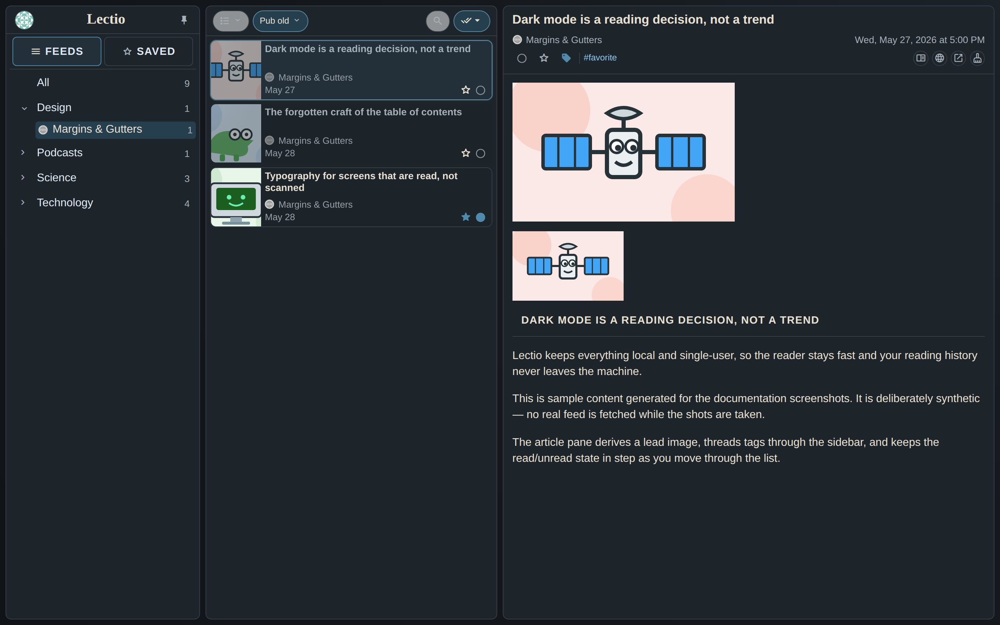
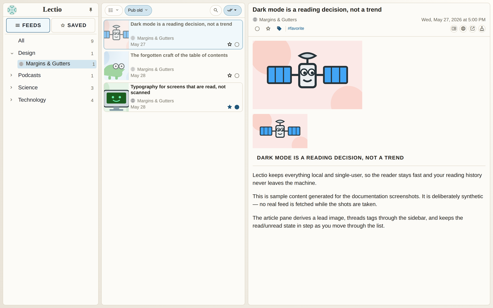

# Lectio

[](https://github.com/joshg253/Lectio/actions/workflows/ci.yml)
[](https://github.com/astral-sh/ruff)


> **Work in progress.** This README covers features and design intent. Setup documentation is forthcoming.

Lectio is a self-hosted feed reader focused on fast reading triage, rich content handling, and automation. It runs well on a personal VPS with full multi-user support, and is built to keep feed reading fast, keyboard-friendly, and workflow-oriented.

---

## What it is

A self-hosted RSS reader with a triage-first interface that adapts from a three-pane desktop layout to narrower tablet and phone workflows. Built on Python + FastAPI + the [`reader`](https://github.com/lemon24/reader) library, with a plain-HTML/JS frontend — no build step, no bundler, no framework.

The design priority is **speed of triage**: quickly marking things read, surfacing what matters, and staying out of the way.

---

## Screenshots

| Dark mode | Light mode |
|---|---|
|  |  |

More shots (settings, automation, feed properties, tags, history, admin) are in
the **[Screenshots wiki page](https://github.com/joshg253/Lectio/wiki/Screenshots)**.

---

## Feature highlights

Full detail lives in the wiki — **[Features](https://github.com/joshg253/Lectio/wiki/Features)**
and **[Multi-user & APIs](https://github.com/joshg253/Lectio/wiki/Multi-user-and-APIs)**.
The short version:

- **Fast triage** — three-pane reader, keyboard nav, context menus, manual and
  feed-provided tags, read history, search (with a Search button and a clear
  control; in the Saved view it also matches the saved article's text, not just
  its title), and a Readability/web-view proxy.
  Bulk mark-as-read shows an **Undo** toast that restores exactly that batch.
- **Rich content** — embeds that actually render (curated trusted-host
  allowlist), inline podcast audio (including audio borrowed from a separate
  host feed), file attachments, recovered YouTube/Bandcamp/SoundCloud embeds,
  and a **persistent audio player** bar that keeps playing as you navigate.
- **Lead images** — per-feed extraction strategies with side-by-side
  comparison, smart crop/fit tuning, caption sourcing, junk-image rejection,
  and full-resolution webcomic panels. A configurable **portrait-image max
  width** (Settings → Appearance) keeps tall images from dominating the pane
  while wide images stay full-width.
- **Automation** — highlight, mark-as-read, tag-filter, deduplicate,
  email-article, outbound-webhook, save-to-Instapaper, **save/star-article**
  (auto-saves into a pinned Saved **Inbox**), add-to-YouTube-playlist, and
  add-to-Quire rules; scoped to all feeds, a folder, a feed, or a
  multi-selected set; run history shows exactly what each run touched.
- **Keep vs. to-do** — **tagging a post keeps it forever**: it triggers a full
  offline capture (page + images) so tagged posts survive a dead feed, while
  **starring** is the lightweight "needs dealing with" marker. A post is kept
  (never auto-pruned, archived offline) whenever it's starred **or** tagged; the
  unified **Saved** view browses everything kept, filterable per feed and per tag.
  Typing a tag **autocompletes from your existing tags**, so they stay consistent
  instead of sprouting near-duplicates.
- **Read-it-later** — save any page via menu, bookmarklet, `/api/save` (share
  sheets), or a browser extension that ships the rendered page past paywalls;
  saved articles get offline capture, tags, and an e-ink **Read Mode** at
  `/read` (paginated, Supernote-friendly). It's the same library in an e-ink
  shape rather than a separate app: the same kept items, the same dates, the
  same tags. You can **sort** (newest / oldest / received — oldest is how you
  read a comic backlog), see each post's **date** in the list and under the
  headline, and **tag from the device** by tapping names in a panel rather than
  typing.

  **Archive and Delete are the two ways to deal with a saved item.** A star
  means *to-do*, not *unread* — you can read something and still not have
  decided what to do with it — so saved items carry a second layer beyond
  read/unread. **Archive** means "done, but keep the contents": it drops the
  star, takes the item out of the inbox, and marks it read, while tags, the
  offline copy, and protection from cleanup all survive. **Delete** means "done,
  and I don't need this": star and tags both go (with a confirm naming the
  tags), along with the offline copy. Neither removes an ordinary feed post —
  it simply goes back to being one. Both mark the item read, because acting on
  something from the list *is* dealing with it, and both show up in **History**.

  **Inbox** holds what you have starred and not yet dealt with — a star means
  *to-do*, so tagged-but-unstarred articles live under **Tags** instead of
  padding the queue. It opens most-recently-starred, because a to-do pile is
  ordered by when you added to it; pick another order and it sticks, and leaving
  the Inbox restores whatever order that view had before.

  **All Saved** sits next to it with everything kept — the same set the main
  app's Saved view shows.

  An article is marked read when you
  reach its **last page**, not when you open it — so browsing the backlog to
  decide what to read no longer clears it behind you. A one-page article counts
  as read as soon as it's open, since the whole thing is on screen.
  A **Scan Saved for duplicates**
  utility (with side-by-side Compare and dead-link checking) cleans up
  same-article-different-URL saves — it never pre-selects anything, and only
  **Check URLs** arms a copy for deletion, and only when that copy's link is
  provably dead. Titles are editable inline in the dialog (✎), for saved copies
  whose title has drifted from the live post; **Re-fetch content** re-extracts a saved
  article in place to repair a bad initial capture — available for any article
  Lectio captured, including ones already filed onto a real feed, and worth
  trying when a capture came out wrong, since a page that extracted badly once
  often extracts correctly later (a re-fetch updates the article's **Received**
  date, never its **Pub** date — Pub stays the date it was published).
  For a page the reader mangles outright — a manual or docs-style page whose
  text is scattered rather than sitting in one article body — **Capture the
  whole page** (a checkbox on Save Article, and **Re-fetch full page** in the
  post menu) keeps everything instead of extracting. It's off by default on
  purpose: on a normal blog post it also keeps the nav and sidebars that
  extraction strips, so it's the escape hatch, not the better setting.
  **File saved articles** matches
  unfiled saves to the subscribed feed they came from (grouped by host, reviewed
  per host before anything moves) — the usual case after importing a read-later
  library built from feeds; an **Instapaper CSV import**
  brings your whole library over with tags and archive state — and tells you how
  much of it belongs to feeds you already follow, so a fresh import doesn't
  quietly become an unfiled backlog; **Unstar tagged articles** clears stars that
  a tag has made redundant — since a tag keeps an article on its own, a star on
  a tagged article is just clutter in the read-later queue. You pick which tags
  to clear, tag by tag, and nothing is preselected. Tags whose names suggest a
  reading queue (`to-read`, `later`) are flagged and left out of "select all",
  because there the star *is* the queue rather than a redundant copy. Only the
  star is removed: the tag, the article, its read state and its offline copy all
  stay. An article carrying several tags keeps its star until every one of those
  tags is selected, so the count on the button is the honest total rather than
  the sum of the rows.
- **Clean up article** (🧹 in the reading pane) — an Aardvark-style editor for a
  post's body. Hovering outlines the element under the cursor and clicking
  removes it; `W`/`N` widen and narrow the selection, `I` isolates (keeps only
  what's selected and drops everything else), `Ctrl+Z` undoes, `Esc` cancels.
  Nothing is written until **Save**, and **Revert cleanup** (📄 next to it)
  restores the article exactly as the feed served it. Good for share widgets,
  "related stories" blocks, newsletter footers, and the player chrome that
  captured pages drag along. What you removed is recorded per post, so a future
  release can promote a removal into a rule for the whole feed.
- **Archive old stars** — the Saved Inbox holds what you starred and have not
  dealt with, so years of older stars sit in it forever. Pick a cutoff (a week, a
  month, a year) and archive everything older in one pass: it leaves the Inbox and
  is marked read, while tags, the offline copy and protection from cleanup are all
  kept, and anything can be un-archived. Shows the age spread and the resulting
  Inbox size before you commit.
- **Re-fetch is undoable, and falls back to the Internet Archive.** Re-pulling an
  article stores the previous body first, so *Revert* puts it back if the result is
  worse. If the publisher now serves a parked page or a section index over the
  article's own URL, Lectio notices, refuses to overwrite your copy with it, and
  asks the Wayback Machine for the real one.
- **Feed Properties is tabbed by job** — *Info*, *Content* (what arrives: dev.to
  filters, YouTube Shorts, subscriber-only posts), *Tuning* (how it looks: images,
  thumbnails, feed type), *Maintenance*, *History*, *Automations*.
- **Hide subscriber-only posts** — a per-feed toggle for paywalled feeds. A paid
  Substack post arrives as nothing but a "Read more" link, which Lectio spots
  without any marker from the publisher, and marks read at fetch time so it drops
  out of Unread while staying findable under All.
- **Bulk actions on the view you drilled into** — pick a tag (optionally narrowed
  to one feed) and either **unstar everything here** or **delete the tag
  everywhere**. The button carries the real count, so the set is stated before you
  press it. Both work in Read Mode too, as visible buttons rather than a
  right-click menu, and deleting a tag there takes two taps.
- **Feed tag suggestions** — tags the feed (or its page) provides appear as chips
  under a post, so filing is one tap. A chip you never want from that feed gets an
  **×**; it stays hidden until you restore it from Feed Properties → *Hidden tags*.
  Nothing is hidden automatically: a feed tagging every post "Lessons" is boilerplate
  by any measure and still exactly the tag you want when filing a guitar lesson.
- **Sort is remembered per view** — Feeds and Saved each keep their own order, so
  reading a publish-date backlog in one doesn't re-sort the other. Views with a
  natural order of their own (the Saved Inbox opens most-recently-starred) use it
  without disturbing what you last chose; leaving them restores it.
- **Retention** — per-folder *Delete after read* (nightly), a **Purge old
  posts** utility with preview, and tombstones that keep deleted posts from
  resurrecting (swept only after they leave the publisher's feed window).
  Starred and tagged posts are never auto-deleted.
- **Feed management** — OPML, resilient RSS/Atom auto-discovery (survives
  stale autodiscovery links and schemeless input, and prefers a blog's own feed
  over the domain-wide firehose on multisite hosts like
  `devblogs.microsoft.com/<blog>/`). When a site advertises a feed that is
  provably gone, it says so and offers a Page Feed rather than handing back an
  address that can't be subscribed. Page Feeds for feedless
  sites, dev.to filtered feeds, YouTube & DeviantArt sync, Bluesky image
  recovery, per-folder refresh cadence, feed compare, fetch history,
  duplicate-feed scanning, and curation-preserving unsubscribe/combine/move —
  unsubscribing a feed that has starred/tagged posts defaults to **keeping**
  them: the feed leaves the tree but its curated items stay browsable per feed
  in Saved. Per-post fixes: delete (tombstoned), edit date, edit title, and
  **edit URL** — repoint a post at a moved or dead source link (a retired
  feedproxy/FeedBurner redirector, or a site reorganization), then **Re-fetch
  content** to pull the article from its new home. The star, tags and read
  state are kept: only the link changes. Per-feed, **edit Website** in Feed
  Properties when an author moved domains without updating their feed's
  `<guid>`/`<link>`: it rewrites every post link onto the new domain (carrying
  stars/tags/read state), records the rule so re-ingested items stay corrected,
  and fixes the site link, favicon and duplicate-scan pairing too. For an author
  who moved more than once, **Other domains** in the same dialog lists every
  domain declared for that feed and lets you add or remove one by hand — needed
  because edit Website can only declare a domain it can still see in the feed,
  which leaves an *older* dead domain with no way in. Adding one migrates any
  posts still on it; a domain with none left is still worth declaring, since it
  pairs old saved links with their current twins in the duplicate scan.
- **Integrations** — Reddit (submit + authenticated fetching), Pinterest
  (pin lead images), Quire (tasks), Instapaper, email (Resend), webhooks;
  per-user OAuth with optional shared-instance credentials. On Star can
  fan out to any of them.
- **Reliability** — conditional GET, per-feed/domain backoff, GUID-churn
  suppression, WebSub real-time push, WAL-mode SQLite, and browser-identity
  fetch fallback for feeds whose servers refuse the default client.
- **Multi-user** — isolated per-user databases with shared content caches;
  **GReader**, **Fever**, and **Miniflux v1** API compatibility.
- **Data portability** — Takeout-style ZIP export/import, online-safe
  backups, and one-shot migrators for **Inoreader, Miniflux, FreshRSS, and
  tt-rss** (feed URLs canonicalized so variants merge, not duplicate).
- **Browser-extension quick subscribe** — answers Feedbin/Nextcloud News
  `?subscribe=` URL patterns, so RSSHub-Radar's quick-subscribe drops feeds
  straight into the Add Feed dialog.

---

## Technical overview

| Layer | What it does |
|---|---|
| `main.py` | FastAPI routes, Jinja2 templates, all request handling |
| `services/` | Feed refresh, lead images, email, starred archive, YouTube, reader API wrapper |
| `reader` library | Feed fetching, parsing, storage, ETag/conditional requests |
| `lectio.db` | reader's SQLite feed+entry store |
| `lectio_meta.sqlite3` | App state: prefs, automation rules, lead images, read history, failure tracking |
| `lectio_meta.sqlite` | Starred/saved entry archive |

Pages stay light at large subscription counts: per-feed row sections (the
sidebar folder feed lists, the Settings → Feeds table, and the Stale view)
load as HTML fragments on first open instead of shipping with every page, and
the app script is a cacheable static file rather than inline JS.

---

## Stack

- **Backend**: Python 3.14, FastAPI, uvicorn
- **Feed library**: [reader](https://github.com/lemon24/reader) (handles HTTP, parsing, ETags, scheduling)
- **Frontend**: Vanilla JS, Jinja2 templates, no build step
- **Database**: SQLite (WAL mode) × 3
- **Deployment**: Docker + docker-compose, Traefik reverse proxy

---

## Development

Enable the lint hook once per clone:

```bash
git config core.hooksPath .githooks
```

It runs `scripts/lint_changed.py` over the lines you staged (ruff, ~40ms) so a
lint problem is fixed in the commit rather than after a CI round-trip. CI runs
the same script across the whole PR. Both are scoped to *changed lines* rather
than whole files, because the repo carries a backlog of existing findings — new
code is held to the rules while the backlog shrinks file by file. `git commit
--no-verify` bypasses it.


- **Tests** — pytest suite (unit, services, integration, scripts) under `tests/`. Run with `uv run pytest`.
- **CI** — GitHub Actions runs the suite on Python 3.14 for every pull request and push to `main` ([`.github/workflows/ci.yml`](.github/workflows/ci.yml)). Dependencies install from the locked `uv.lock` (`uv sync --frozen`), and the run treats any `DeprecationWarning` as an error so they surface immediately rather than accumulating.
- **Dependency audit** — `uv audit` (OSV-backed) scans the locked dependencies for known vulnerabilities and deprecated packages. Run it locally with `make audit`; CI runs the same scan. It's a uv preview feature, so it's kept separate from `make test` locally and the CI step is informational (non-blocking) for now.

---

## Status

Active personal use. Not yet documented for general deployment. The codebase moves fast — APIs, DB schema, and config format may change without notice.

Issues and PRs welcome, but this is primarily a personal project.
