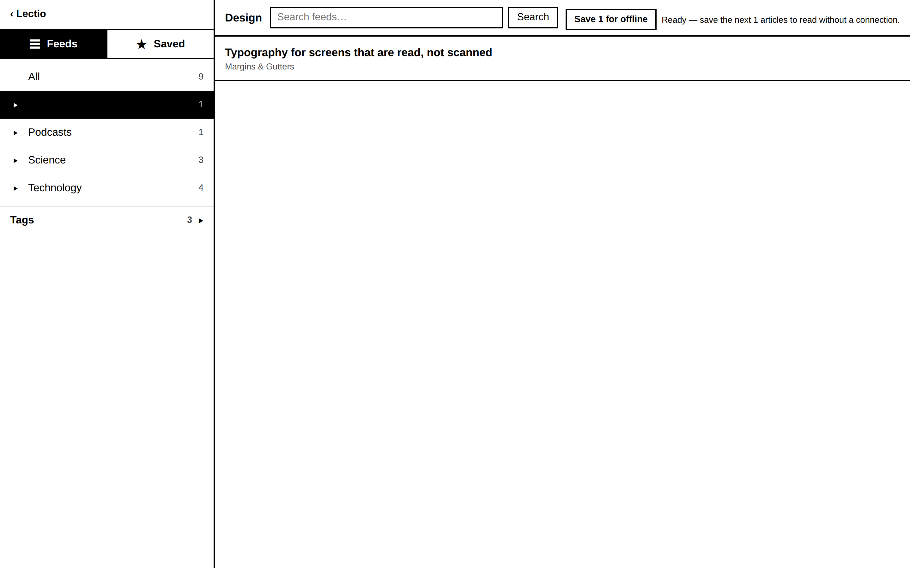
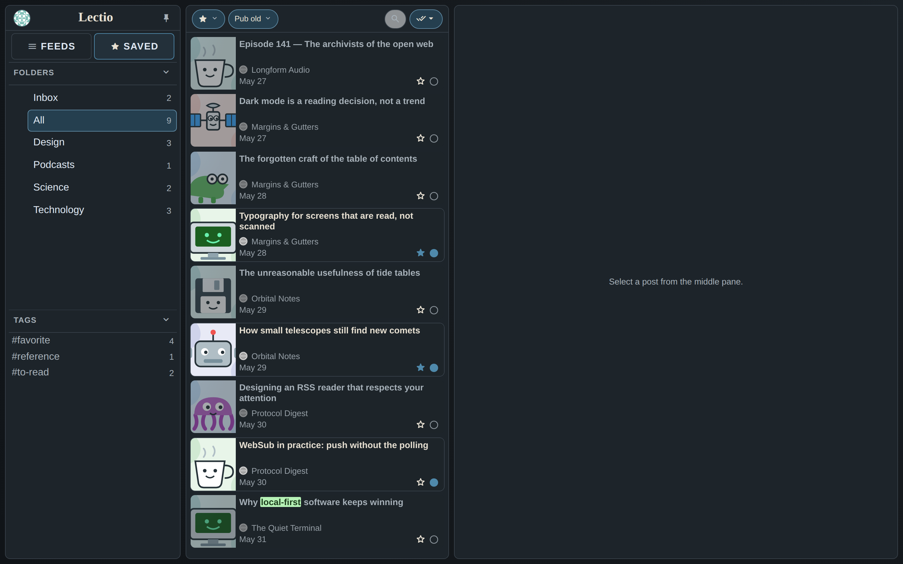

# Lectio

[](https://github.com/joshg253/Lectio/actions/workflows/ci.yml)
[](https://github.com/astral-sh/ruff)


> **Work in progress.** This README covers features and design intent. Setup documentation is forthcoming.

Lectio is a self-hosted feed reader focused on fast reading triage, rich content handling, and automation. It runs well on a personal VPS with full multi-user support, and is built to keep feed reading fast, keyboard-friendly, and workflow-oriented.

---

## What it is

A self-hosted RSS reader with a triage-first interface that adapts from a three-pane desktop layout to narrower tablet and phone workflows. Built on Python + FastAPI + the [`reader`](https://github.com/lemon24/reader) library, with a plain-HTML/JS frontend — no build step, no bundler, no framework.

The design priority is **speed of triage**: quickly marking things read, surfacing what matters, and staying out of the way.

---

## Screenshots

| Dark mode | Light mode |
|---|---|
|  |  |

| Read Mode (e-ink) | Saved articles |
|---|---|
|  |  |

More shots — the phone layout, Save Article, settings, automation, feed
properties, tags, history and admin — are on the
**[Screenshots wiki page](https://github.com/joshg253/Lectio/wiki/Screenshots)**.
All of them are generated from synthetic demo data, never a real library.

---

## What it does

The full tour — every feature, organized by area — is on the
**[Features wiki page](https://github.com/joshg253/Lectio/wiki/Features)**. The
short version:

- **Triage first.** Three-pane reader, keyboard nav everywhere, context menus,
  bulk mark-as-read that updates in place, per-view remembered sort, and a
  layout that collapses to two panes on a tablet and one on a phone.
- **Built for a phone, not just shrunk onto one.** One pane at a time, with Back
  walking the view stack — article → feed → folder — and then toggling the folder
  drawer instead of closing the tab out from under you. Pull down from the top of
  an article to toggle Reader view, and pull again to come back.
- **Filter, then act on the whole result.** *Filter this view* narrows the post
  list as you type — by title, link or feed name — separately from search, which
  is a server query that changes what is fetched. **Move all shown to feed…**
  then files everything the filter matched, resolved server-side, so it covers
  the whole view rather than the page your browser happens to have scrolled in.
- **Tagging a post keeps it forever.** A tag triggers a full offline capture —
  page, readability text, every image, and any files the post links to — so a
  kept article survives the site going down. Stars are the to-do pile; tags are
  the keep pile.
- **Read-it-later built in.** Save any page (menu, bookmarklet, `/api/save`, or
  the browser extension) with no feed needed, then read it in **Read Mode**, an
  e-ink-friendly reading app at `/read` that works offline — including
  Archive, Delete and mark-read, which queue and drain when you reconnect.
- **Content that actually renders.** Feed sanitization is Lectio's own, so
  embeds survive: sandboxed players from a curated host allowlist, inline SVG
  and MathML, recovered YouTube embeds, podcast audio (even when it lives in a
  separate host feed), and images kept at the author's layout and a sane size.
- **Automation.** Highlight, mark-as-read, tag-filter, deduplicate, and
  send-to-destination rules (Instapaper, Pinterest, Reddit, Quire, email,
  YouTube playlists, webhooks) at any scope, with dry-run and run history.
- **Feed management that expects the real web.** Resilient auto-discovery,
  Page Feeds for feedless sites, dev.to and DeviantArt adapters, conditional
  GET, per-feed and per-domain backoff, GUID-churn suppression, feed compare,
  duplicate scanning, and unsubscribe that keeps your curation.
- **Fix a post in place.** Edit its date, title or URL; clean up its body with
  an Aardvark-style element remover; re-fetch its content — undoably, with an
  Internet Archive fallback — one post, or a whole feed or folder at a time.
- **Yours to run.** Isolated per-user databases with shared content caches,
  Google Reader / Fever / Miniflux v1 APIs, WebSub push, Takeout-style
  export/import, and no build step: plain HTML and JS, no bundler, no framework.

---

## Technical overview

| Layer | What it does |
|---|---|
| `main.py` | FastAPI routes, Jinja2 templates, all request handling |
| `services/` | Feed refresh, lead images, email, starred archive, YouTube, reader API wrapper |
| `reader` library | Feed fetching, parsing, storage, ETag/conditional requests |
| `lectio.db` | reader's SQLite feed+entry store |
| `lectio_meta.sqlite3` | App state: prefs, automation rules, lead images, read history, failure tracking |
| `lectio_meta.sqlite` | Starred/saved entry archive |

Dates are worked out rather than trusted blindly. A publisher that ships no
date — or ships a placeholder like the Unix epoch, which importers and parsers
both like to write — no longer strands a post at "1970": Lectio falls back to the
date in the permalink (`/2019/07/06/` or `/2025-11-22/`), then a month-precision
permalink, then a date in the title, and only then to when it first saw the post.
Posts nothing can date say so instead of quietly showing their arrival time as a
publication date. You can also correct any post's date by hand, including saved
posts whose feed you've since unsubscribed from.

When a saved article's page rots, **Re-fetch from Internet Archive** pulls the
snapshot instead — and because archived copies usually still carry the byline the
publisher has since dropped, that often recovers the date as well as the text.

**Keep the files a post links to.** Some posts are really a wrapper around a
download — guitar-pro's tab posts link `.gp` files and PDF lyric sheets that
vanish with the article, so keeping the text without them keeps the wrong half.
Name the extensions in Feed Properties and they're captured alongside the post
when you star or tag it, served from the same offline archive. Extensions only:
there's deliberately no wildcard, and page types (`html`, `php`, …) are always
ignored — that list is what keeps this a capture of named file types rather than
a crawl of every link on the page. Files on a separate asset domain are fine,
which is the normal case.

**Suggested tags per feed.** A feed with a stable subject rarely tags its own
posts — a guitar blog doesn't tag anything "guitar" — so filing meant typing the
same word every time. Pin tags to a feed in Feed Properties and they're offered
as chips on every post in it, ahead of the feed's own tags and never shown twice
if the publisher happens to ship the same one. They're a suggestion, not an
automatic tag; a tag rule already covers that. Picking a tag from the
autocomplete applies it straight away rather than making you confirm.

Some comic hosts publish a thumbnail where the comic should be. Tapas and
Webtoons feeds carry one image per episode — fine in the post list, wrong in the
article, since the episode itself can be fifty stacked panels. Lectio reads the
episode and shows all of them, keeping the feed's picture as the list thumbnail.

Transparent images keep their transparency and the theme paints behind them
(`--img-backdrop`, white in both themes) — black line art on a dark page was
otherwise invisible.

Scheduled refresh is watchdogged. Feeds are fetched sequentially, so one host
that accepts a connection and then goes silent can stall every feed behind it —
invisibly, since the app keeps serving. Every fetch carries a read deadline, the
scheduler loop cannot be killed by an exception, and a watchdog trips when a pass
stops *advancing* (not merely when it takes a while — a full-library pass runs for
an hour legitimately). Past a longer threshold it exits so the container restarts,
since a thread wedged in a socket read cannot be cancelled. `/healthz` reports the
stall but keeps returning 200: a reader whose refresh is stuck is still readable,
and failing the probe would take the whole app out of the reverse proxy. Tunable
via `LECTIO_FEED_READ_TIMEOUT`, `LECTIO_SCHEDULER_STALL_SECONDS` and
`LECTIO_SCHEDULER_STALL_RESTART_SECONDS` (see `.env.example`).

Pages stay light at large subscription counts: per-feed row sections (the
sidebar folder feed lists, the Settings → Feeds table, and the Stale view)
load as HTML fragments on first open instead of shipping with every page, and
the app script is a cacheable static file rather than inline JS.

---

## Stack

- **Backend**: Python 3.14, FastAPI, uvicorn
- **Feed library**: [reader](https://github.com/lemon24/reader) (handles HTTP, parsing, ETags, scheduling)
- **Frontend**: Vanilla JS, Jinja2 templates, no build step
- **Database**: SQLite (WAL mode) × 3
- **Deployment**: Docker + docker-compose, Traefik reverse proxy

---

## Development

Enable the lint hook once per clone:

```bash
git config core.hooksPath .githooks
```

It runs `scripts/lint_changed.py` over the lines you staged (ruff, ~40ms) so a
lint problem is fixed in the commit rather than after a CI round-trip. CI runs
the same script across the whole PR. Both are scoped to *changed lines* rather
than whole files, because the repo carries a backlog of existing findings — new
code is held to the rules while the backlog shrinks file by file. `git commit
--no-verify` bypasses it.


- **Tests** — pytest suite (unit, services, integration, scripts) under `tests/`. Run with `uv run pytest`.
- **CI** — GitHub Actions runs the suite on Python 3.14 for every pull request and push to `main` ([`.github/workflows/ci.yml`](.github/workflows/ci.yml)). Dependencies install from the locked `uv.lock` (`uv sync --frozen`), and the run treats any `DeprecationWarning` as an error so they surface immediately rather than accumulating.
- **Dependency audit** — `uv audit` (OSV-backed) scans the locked dependencies for known vulnerabilities and deprecated packages. Run it locally with `make audit`; CI runs the same scan. It's a uv preview feature, so it's kept separate from `make test` locally and the CI step is informational (non-blocking) for now.

---

## Status

Active personal use. Not yet documented for general deployment. The codebase moves fast — APIs, DB schema, and config format may change without notice.

Issues and PRs welcome, but this is primarily a personal project.
